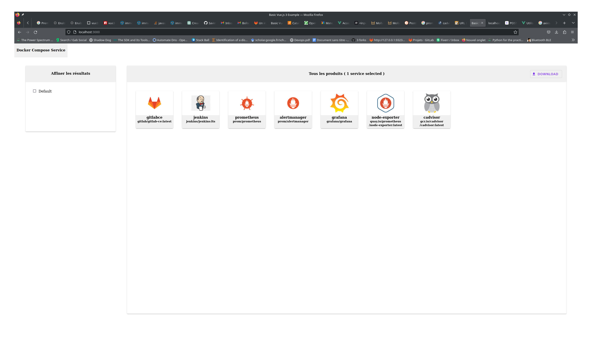
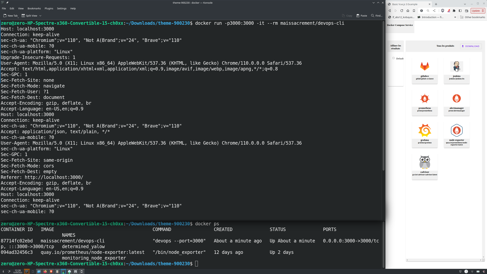
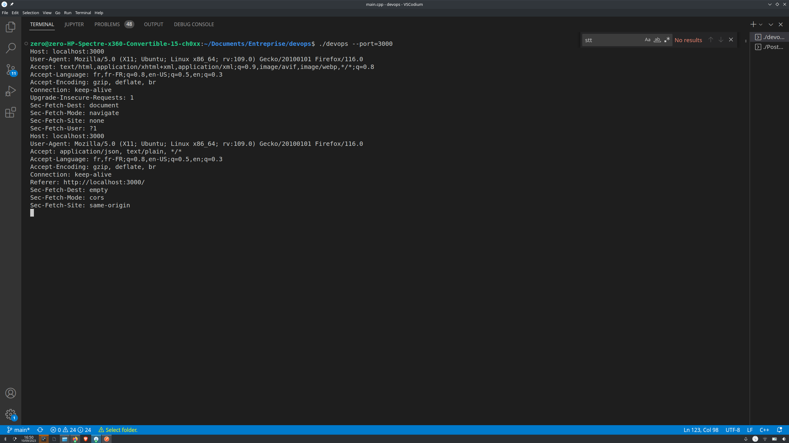
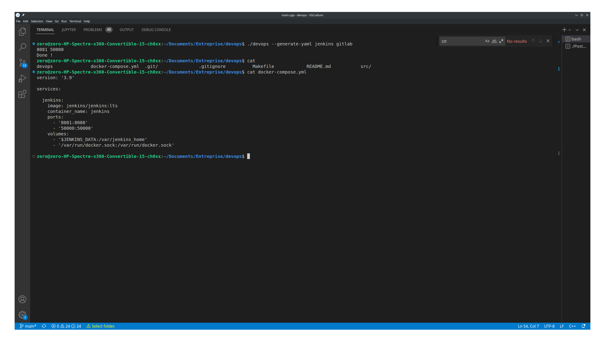

# Devops cli

## How to run

get help:
```
devops --help
```

run web server with linux 64bit shell:
```shell
devops --port=3000
```

generate docker-compose.yml file using cli:
```shell
devops --generate-yaml gitlabce jenkins prometheus cadavisor ...
```

docker:
```shell
docker run -p3000:3000 -it --rm maissacrement/devops-cli
```

## Preview







